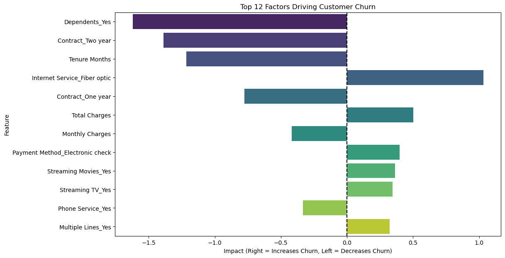

# Telco Customer Churn Prediction 📉

## 📌 Project Overview
Customer churn (attrition) is a critical metric for subscription-based businesses. This project utilizes **Logistic Regression** to predict which customers are at high risk of leaving a telecommunications provider.

By analyzing customer demographics, services, and contract details, the model identifies the key drivers of churn, enabling the company to take proactive retention actions.

## 🎯 Business Goal
**Reduce Customer Churn Rate:** The primary objective is to identify at-risk customers early.
* **Target Metric:** Recall (Sensitivity). We prioritize capturing as many potential churners as possible, even if it means flagging some safe customers (False Positives are acceptable; False Negatives are costly).

## 🛠️ Tech Stack
* **Language:** Python
* **Libraries:** Pandas, Scikit-Learn, Seaborn, Matplotlib
* **Model:** Logistic Regression (with balanced class weights)

## 📊 Key Findings & Insights
My analysis identified specific cohorts with the highest risk of attrition:



1.  **Fiber Optic Users are High Risk:**
    * **Insight:** Having Fiber Optic internet is the #1 strongest predictor of churn.
    * **Recommendation:** Investigate service quality (outages, speeds) and pricing competitiveness for Fiber Optic packages immediately.
2.  **Contract Type Matters:**
    * **Insight:** Customers on Month-to-Month contracts are significantly more likely to leave than those on 1-year or 2-year contracts.
    * **Recommendation:** Offer a 10% discount to month-to-month users if they switch to a 1-year commitment.
3.  **Payment Method Friction:**
    * **Insight:** Users paying via "Electronic Check" churn at a higher rate.
    * **Recommendation:** Incentivize users to switch to automatic credit card payments or bank transfers to reduce payment friction.

## 📈 Model Performance
* **Recall:** 78% (The model successfully identifies ~4 out of 5 churners).
* **ROC-AUC Score:** 0.85 (Strong ability to distinguish between churners and non-churners).
* **Accuracy:** 74%

## 📂 Project Structure
* `Telco_Churn_Prediction.ipynb`: The Jupyter Notebook containing data cleaning, EDA, preprocessing, and modeling.
* `Telco_customer_churn.xlsx`: The raw dataset used for training.
* `requirements.txt`: List of dependencies.

## 🚀 How to Run
1. Clone the repository.
2. Install dependencies:
   ```bash

   pip install -r requirements.txt
